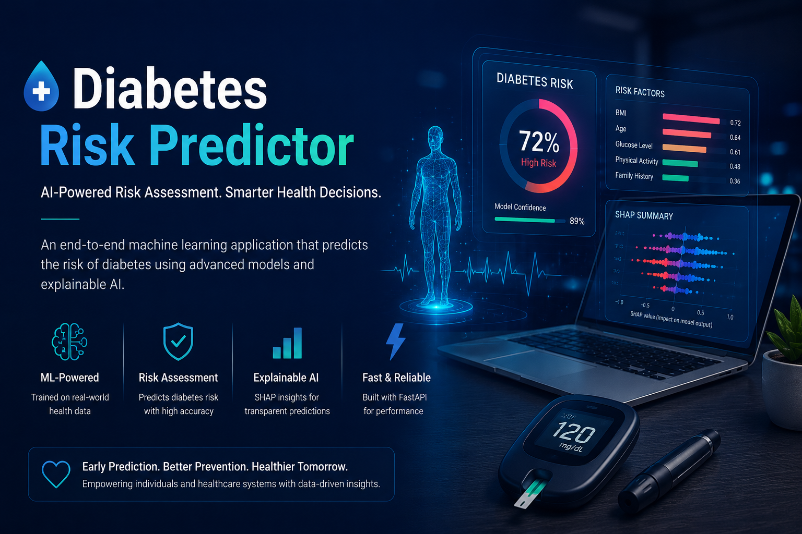
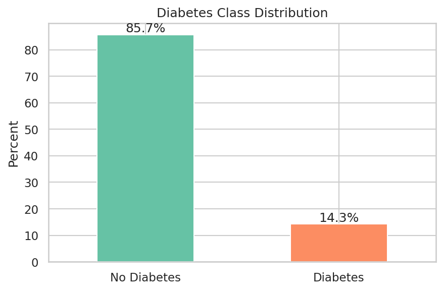
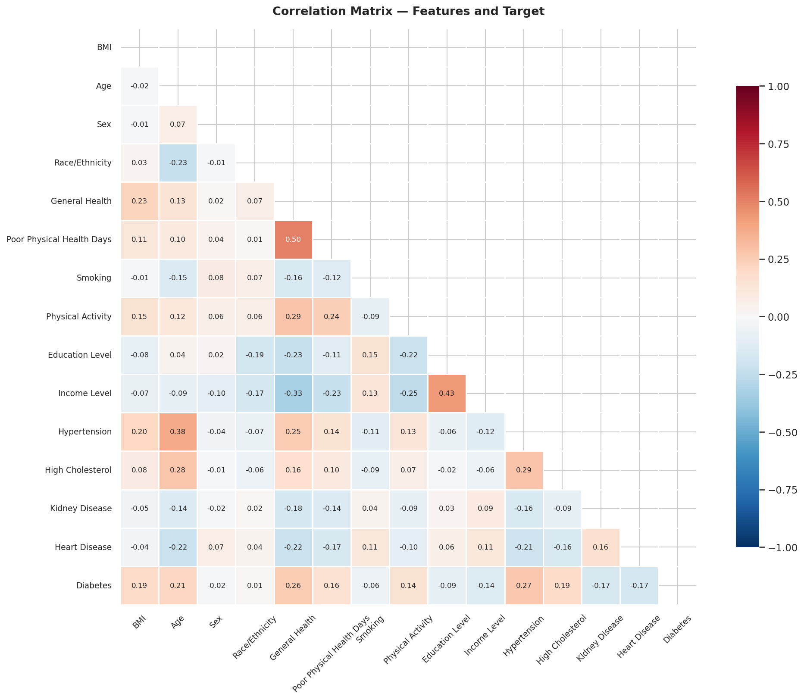
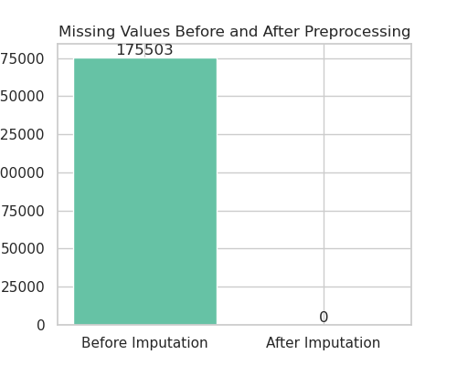
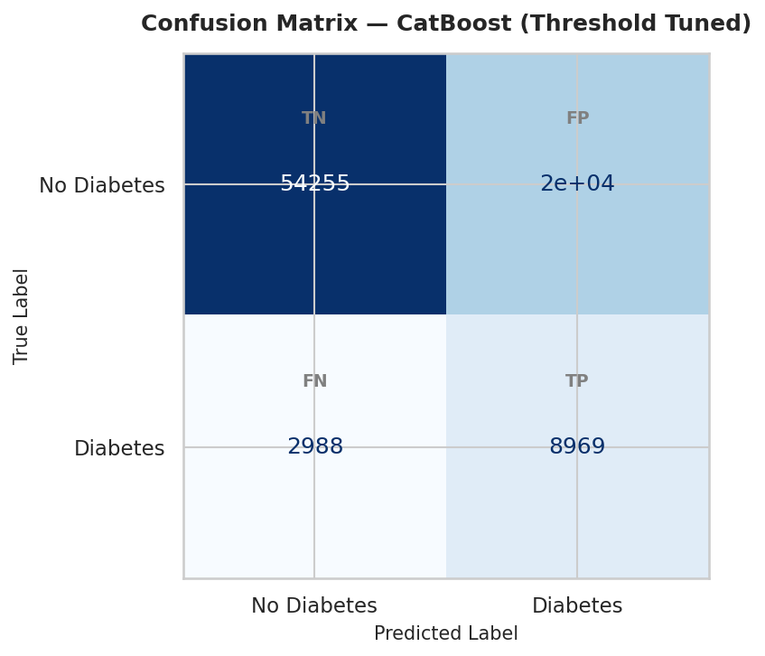
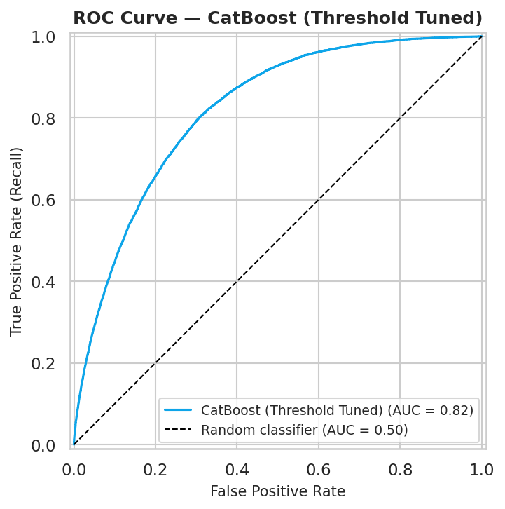
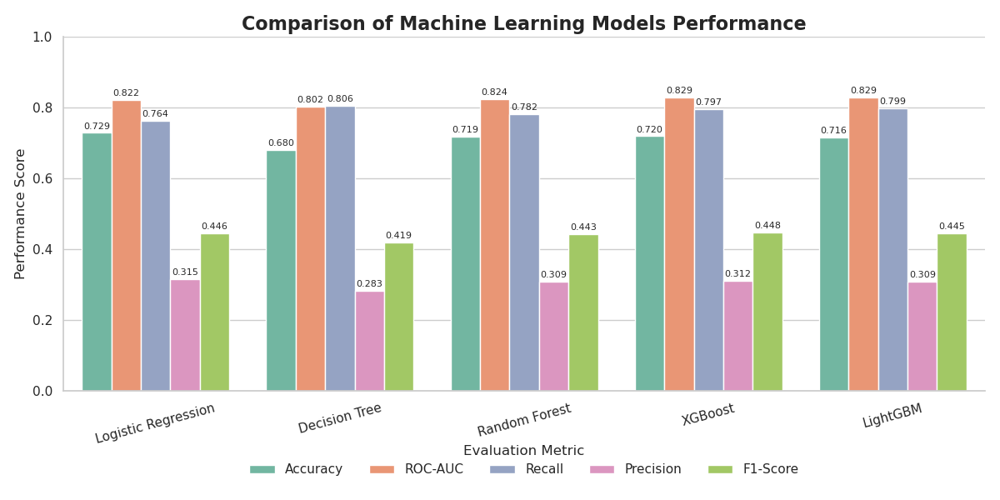
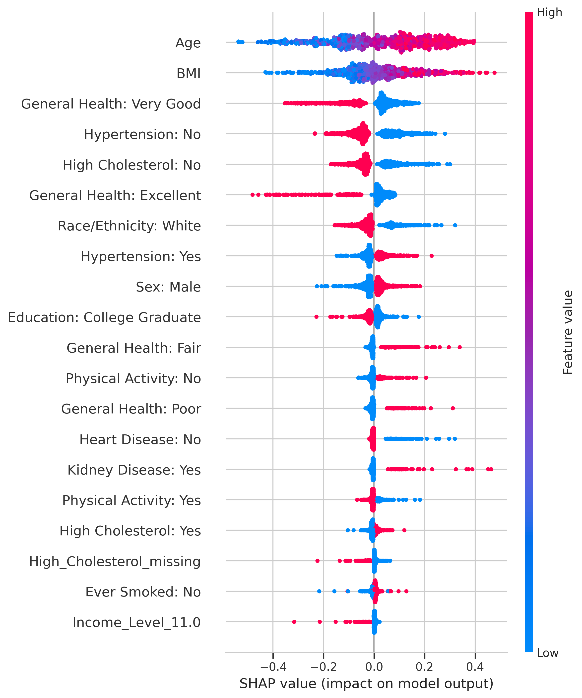

# Diabetes Risk Predictor — Early Detection of Type 2 Diabetes Using Machine Learning and Explainable AI

> _"Know your risk before it becomes your reality."_
> An end-to-end clinical decision-support system that predicts Type 2 diabetes risk and explains every prediction using Explainable AI.

[](https://github.com/Orandifelix/diabetes-risk-prediction-xai/actions/workflows/ci.yml)
[](LICENSE)
[](https://www.python.org/)
[](https://xgboost.readthedocs.io/)
[](https://shap.readthedocs.io/)




---

## Table of Contents

- [Elevator Pitch](#elevator-pitch)
- [Business Understanding](#business-understanding)
- [Data Understanding](#data-understanding)
- [Modeling](#modeling)
- [Evaluation](#evaluation)
- [Explainable AI (XAI)](#explainable-ai-xai)
- [Conclusion](#conclusion)
- [Repository Structure](#repository-structure)
- [Repository Navigation](#repository-navigation)
- [Installation & Reproduction](#installation--reproduction)
- [Deployment](#deployment)
- [Results in Action](#results-in-action)
- [Technologies Used](#technologies-used)
- [Future Work](#future-work)
- [References](#references)
- [License](#license)
- [Author](#author)
- [Contributing](#contributing)
- [Changelog](#changelog)
- [Acknowledgements](#acknowledgements)

---

## Elevator Pitch

Diabetes is a leading global health crisis, affecting over 500 million people worldwide, yet early detection remains a challenge. This project develops an explainable machine learning system that predicts Type 2 diabetes risk using data from the CDC's Behavioral Risk Factor Surveillance System (BRFSS) 2023. By combining powerful gradient boosting models with SHAP and LIME explanations, the system provides both accurate predictions and transparent, interpretable insights to support clinicians and public health professionals in early intervention.

---

## Business Understanding

### Why Diabetes Matters

Type 2 Diabetes Mellitus (T2DM) is one of the fastest-growing chronic diseases globally, with prevalence rising dramatically across all age groups. According to the International Diabetes Federation (2021), over 500 million adults are living with diabetes, and this number is projected to reach 783 million by 2045. Diabetes is a major contributor to cardiovascular disease, kidney failure, stroke, and blindness, placing a significant burden on individuals, healthcare systems, and economies.

### Why Prediction Matters

Early identification of individuals at high risk enables targeted preventive interventions, lifestyle modifications, and timely clinical management. However, many cases remain undiagnosed until complications develop. Traditional screening methods often rely on limited clinical criteria and may not effectively identify at-risk individuals across diverse populations. A data‑driven predictive model can enhance screening efficiency by leveraging readily available health survey data to prioritize those who would benefit most from further evaluation.

### Why Explainability Matters

In healthcare, trust and transparency are paramount. Clinicians and patients need to understand *why* a model makes a particular prediction—not just *what* it predicts. Black‑box models, while potentially accurate, can undermine clinical adoption due to a lack of interpretability. Explainable AI (XAI) techniques such as SHAP and LIME address this by providing both global feature importance and local explanations for individual predictions, enabling clinicians to validate model reasoning and make informed decisions.

### Why Interpretable AI is Critical for Clinicians

- **Trust**: Clinicians are more likely to adopt a system they can understand and validate.
- **Actionability**: Knowing which features drive a prediction allows for targeted interventions (e.g., "This patient’s elevated BMI and hypertension are the primary risk factors").
- **Regulatory Compliance**: Explainability supports auditing and accountability in clinical decision support systems.
- **Patient Communication**: Transparent explanations help clinicians discuss risk factors and preventive strategies with patients.

---

## Data Understanding

### Dataset Source
The project uses the **Behavioral Risk Factor Surveillance System (BRFSS) 2023** dataset, a nationally representative health survey conducted annually by the Centers for Disease Control and Prevention (CDC). The dataset captures self‑reported information on demographics, health conditions, lifestyle behaviors, and healthcare access from U.S. adults through telephone interviews.

### Dataset Details
- **Records:** 433,323 respondents
- **Features:** 350 variables
- **Target Variable:** `DIABETE4` (recoded to binary: 1 = diagnosed diabetes, 0 = no diabetes)
- **Selected Features:** 14 predictor variables, including BMI, age, sex, race/ethnicity, general health, physical health, smoking history, physical activity, education, income, hypertension, high cholesterol, kidney disease, and heart disease.

### Data Preparation
- Recoded special BRFSS response codes (e.g., “Don’t Know”, “Refused”) to missing.
- Capped BMI values above 60.0 to mitigate extreme outliers.
- Created missingness indicator variables for high‑missingness features (income, cholesterol, BMI, smoking).
- Performed median imputation for numerical features and mode imputation for categorical features within a preprocessing pipeline.

### Visualizations

#### Class Distribution
The target variable is imbalanced: ~85.7% non‑diabetic, ~14.3% diabetic, reflecting the general population prevalence.



#### Correlation Heatmap
Hypertension, general health, age, BMI, and high cholesterol show the strongest positive correlations with diabetes.



#### Missing Values
Missingness is concentrated in income, high cholesterol, BMI, and smoking status, which were handled via imputation.



---

## Modeling

### Preprocessing Pipeline
A scikit‑learn `Pipeline` was constructed to ensure reproducibility and prevent data leakage:

- **Numeric Features:** Standard scaling after median imputation.
- **Categorical Features:** One‑hot encoding after mode imputation.
- **Missingness Indicators:** Binary flags for high‑missingness features.
- **Class Imbalance:** `class_weight='balanced'` (Logistic Regression, Decision Tree, Random Forest) and `scale_pos_weight` (XGBoost, LightGBM) were applied to address the imbalance.

### Model Selection
Four candidate models were trained and compared:

- **Logistic Regression** – Baseline interpretable model.
- **Decision Tree** – Simple non‑linear model.
- **Random Forest** – Ensemble of trees with bagging.
- **XGBoost** – Gradient boosting with regularization.
- **LightGBM** – Lightweight gradient boosting.

All models were evaluated on a held‑out test set (20% of data).

### Hyperparameter Tuning
The best‑performing model, **XGBoost**, was further tuned using `GridSearchCV` with 3‑fold cross‑validation. The optimal hyperparameters were:
- `n_estimators=200`
- `max_depth=4`
- `learning_rate=0.05`
- `subsample=0.85`
- `colsample_bytree=0.85`

---

## Evaluation

### Model Performance Comparison
| Model               | Accuracy | ROC‑AUC | Recall | Precision | F1‑Score |
|---------------------|----------|---------|--------|-----------|----------|
| Logistic Regression | 0.729    | 0.822   | 0.764  | 0.315     | 0.446    |
| Decision Tree       | 0.680    | 0.802   | 0.806  | 0.283     | 0.419    |
| Random Forest       | 0.719    | 0.824   | 0.782  | 0.309     | 0.443    |
| **XGBoost**         | **0.720**| **0.829**| **0.797**| **0.312** | **0.448**|
| LightGBM            | 0.716    | 0.829   | 0.799  | 0.309     | 0.445    |

### Best Model: XGBoost
- **ROC‑AUC:** 0.829
- **Recall (Sensitivity):** 0.797 – correctly identifies ~80% of diabetic cases.
- **Precision:** 0.312 – moderate false‑positive rate; acceptable for a screening tool where missing a case is more critical.
- **Accuracy:** 0.720

### Confusion Matrix


### ROC Curve


### Model Comparison


---

## Explainable AI (XAI)

### Why XAI Matters
To build trust and facilitate clinical adoption, we employed two complementary XAI techniques:
- **SHAP (SHapley Additive exPlanations):** Provides global and local feature importance based on cooperative game theory.
- **LIME (Local Interpretable Model‑agnostic Explanations):** Generates local explanations by approximating the model’s behaviour around a specific prediction.

### Global Feature Importance (SHAP)
SHAP summary plots reveal that hypertension, general health, age, BMI, and high cholesterol are the most influential predictors across the entire dataset.



### Local Explanations
For any individual prediction, SHAP force plots and LIME explanations show which features pushed the prediction toward diabetes or away from it. This allows clinicians to understand the specific risk factors for each patient.

#### SHAP Force Plot (Example)


#### LIME Explanation (Example)


### Business Value of XAI
- **Clinical Trust:** Explainable predictions are more likely to be accepted by healthcare providers.
- **Actionable Insights:** Identifying specific drivers (e.g., “high BMI and hypertension”) enables targeted interventions.
- **Regulatory Readiness:** Transparent models align with emerging regulations on algorithmic accountability in healthcare.

---

## Conclusion

This project successfully developed an explainable machine learning system for Type 2 diabetes risk prediction using BRFSS data. The XGBoost model achieved a strong ROC‑AUC of 0.829 and a recall of 0.797, demonstrating its ability to identify a large proportion of diabetic individuals while maintaining acceptable false‑positive rates. The integration of SHAP and LIME provides clear, interpretable explanations at both global and local levels, enabling clinicians and patients to understand and act upon the predictions.

**Business Impact:** The system can serve as a scalable, evidence‑based screening tool to prioritise high‑risk individuals for preventive care, reduce undiagnosed cases, and support population health management.

**Future Work:**
- Deploy the model as a web application for real‑time risk assessment.
- Incorporate additional clinical data (e.g., lab results, medical history) for improved accuracy.
- Implement continuous model retraining with new survey data.
- Expand explanations to include patient‑friendly language for shared decision‑making.

---

## Repository Structure

```text
diabetes-risk-prediction-xai/
│
├── .github/
│   └── workflows/
│       └── ci.yml                     # Continuous integration pipeline
│
├── datasets/
│   ├── raw/                           # Original unmodified source data
│   └── processed/                     # Cleaned and feature-engineered data
│
├── docs/
│   ├── architecture.md                # System design and component overview
│   ├── dashboard.md                   # Dashboard usage and API reference
│   └── methodology.md                 # Modelling decisions and rationale
│
├── images/
│   ├── 01_data_understanding/         # Dataset overview figures
│   ├── 02_eda/                        # EDA plots and distributions
│   ├── 03_feature_engineering/        # Feature selection and encoding figures
│   ├── 04_modeling/                   # Training curves and tuning results
│   ├── 05_evaluation/                 # Confusion matrix, ROC, model comparison
│   ├── 06_interpretability/           # SHAP and LIME visualizations
│   ├── 07_dashboard/                  # Dashboard screenshots
│   └── 08_presentation/               # Header image and slide exports
│
├── models/
│   ├── final_model.joblib             # Trained XGBoost/LightGBM classifier
│   ├── preprocessor.joblib            # Fitted preprocessing pipeline (Imputation, Scaling)
│   └── metadata.json                  # Model version, metrics, optimized thresholds
│
├── notebooks/
│   ├── diabetes_prediction.ipynb      # Final notebook — runs end-to-end (SMOTE, Tuning, Thresholds)
│   └── notebook.pdf                   # Exported PDF version
│
├── presentations/
│   ├── presentation.pptx              # Editable slide deck
│   ├── presentation.pdf               # PDF export for submission
│   └── speaker_notes.md               # Presenter notes and talking points
│
├── reports/
│   ├── final_report.pdf               # Comprehensive project report
│   └── proposal.pdf                   # Approved capstone proposal
│
├── submission/
│   ├── github.pdf                     # GitHub repository PDF snapshot
│   ├── notebook.pdf                   # Notebook PDF for submission
│   └── presentation.pdf               # Presentation PDF for submission
│
├── app/
│   ├── api/                           # FastAPI backend (prediction & custom threshold logic)
│   │   ├── main.py
│   │   ├── schemas.py
│   │   └── utils.py
│   └── web/                           # Next.js frontend dashboard
│       ├── pages/
│       ├── components/
│       └── styles/
│
├── .gitignore                         # Excludes data files, envs, caches
├── CHANGELOG.md                       # Version history and release notes
├── CONTRIBUTING.md                    # Contribution guide and setup steps
├── LICENSE                            # MIT License
├── README.md                          # Project home page
├── environment.yml                    # Conda environment specification (with LightGBM & Imblearn)
└── requirements.txt                   # Pip dependency list

---
## 🗺️ Repository Navigation

- 📓 [Final Notebook](notebooks/diabetes_prediction.ipynb)
- 🎞 [Presentation](presentations/presentation.pdf)
- 🌐 [Live Application](#) *(Deployment link if available)*
- ⚙ [Backend API](app/api/main.py) *(FastAPI)*
- 🖥 [Frontend Dashboard](app/web) *(Next.js)*
- 📄 [Final Report](reports/final_report.pdf)
- 📋 [Proposal](reports/proposal.pdf)
- 📚 [Documentation](docs/)

---

## ⚙️ Installation & Reproduction

### Prerequisites
- **Python 3.8+**
- **Git**
- **Node.js 16+** *(Optional: for frontend dashboard)*
- **Conda** *(Optional: for environment management)*

### Clone the Repository
```bash
git clone https://github.com/your-username/diabetes-risk-prediction-xai.git
cd diabetes-risk-prediction-xai
```

### Set Up Python Environment

**Using Conda:**
```bash
conda env create -f environment.yml
conda activate diabetes-xai
```

**Using pip:**
```bash
python -m venv venv
source venv/bin/activate      # On Windows: venv\Scripts\activate
pip install -r requirements.txt
```

### Run the Jupyter Notebook
Launch Jupyter Lab or Notebook and open `notebooks/diabetes_prediction.ipynb` to explore the complete analysis, data preparation (mean imputation), SMOTE resampling, pipeline hyperparameter tuning, and XAI explanations.

### Run the Backend API (FastAPI)
```bash
cd app/api
uvicorn main:app --reload
```
The API will be available at `http://localhost:8000`. Interactive API documentation and custom threshold prediction endpoints can be tested at `http://localhost:8000/docs`.

### Run the Frontend (Next.js)
```bash
cd app/web
yarn install
yarn dev
```
The dashboard will be available at `http://localhost:3000`.

---

## 🚀 Deployment

- **Frontend:** Deployed on Vercel (or Netlify).
- **Backend API:** Deployed on Render, Heroku, or AWS.
- **CI/CD:** GitHub Actions (see `.github/workflows/ci.yml`) runs tests, formatting, and linting on push.

---

## 📊 Results in Action

### Dashboard Screenshot


### SHAP Global Feature Importance


### ROC Curve & Decision Threshold Optimization


---

## 🛠️ Technologies Used

### Machine Learning & XAI
- **XGBoost, LightGBM** – Gradient boosting models optimized via cross-validation pipelines.
- **Imbalanced-Learn** – SMOTE resampling contained within training folds to avoid data leakage.
- **Scikit‑learn** – Preprocessing pipelines, data preparation (imputation/scaling), and evaluation metrics.
- **SHAP, LIME** – Model explainability and feature importance analysis.

### Data Processing & Analysis
- **Pandas, NumPy** – Data manipulation and structural preparation.
- **Matplotlib, Seaborn** – Exploratory data analysis (EDA) plots and distribution metrics.

### Backend
- **FastAPI** – API framework managing continuous outputs and decision thresholds.
- **SQLAlchemy** – ORM *(if database integration)*.
- **PostgreSQL** – Database *(if used)*.

### Frontend
- **Next.js** – React framework for the interactive clinician interface.
- **TailwindCSS** – Clean UI styling.
- **Chart.js / Recharts** – Interactive probability and risk tracking visualizations.

### Deployment & DevOps
- **Render** – Backend hosting.
- **Vercel** – Frontend hosting.
- **GitHub Actions** – Continuous Integration (CI) tracking.

---

## 🔮 Future Work

- **Continuous Model Retraining:** Automatically retrain on new BRFSS releases.
- **EHR Integration:** Connect to electronic health records for real‑time risk scoring.
- **Mobile Application:** Provide a patient‑facing risk assessment tool.
- **Clinical Decision Support:** Embed adjustable risk thresholds directly into clinical workflows.
- **Expanded Data Sources:** Incorporate lab results, genetic data, and social determinants.
- **Federated Learning:** Train models across multiple institutions without sharing raw patient data.

---

## 🤝 Reproduction & Contribution

All technical steps required to replicate this pipeline — from environment setup to data download, preprocessing, model training, and SHAP interpretation — are explicitly documented in [`CONTRIBUTING.md`](CONTRIBUTING.md).

If you encounter issues, have suggestions for improvements, or want to contribute new features, please open an issue or submit a pull request. Continuous integration status is available on the [GitHub Actions Dashboard](https://github.com/Orandifelix/diabetes-risk-prediction-xai/actions).

---

## 👥 Contributors

| Name | GitHub | Role |
| :--- | :--- | :--- |
| **Stephen Mwaura** | [@S-Mwaura](https://github.com/S-Mwaura) | Project Lead · Modeling |
| **Angela Masaki** | [@MoonwaMasaki](https://github.com/MoonwaMasaki) | Data Engineering · EDA |
| **Diana Byegon** | [@byegond-beep](https://github.com/byegond-beep) | Feature Engineering · Evaluation |
| **Kevin Kisengu** | [@K-OK27](https://github.com/K-OK27) | Explainability · XAI |
| **Orandi Felix** | [@Orandifelix](https://github.com/Orandifelix) | Model Documentation · App Development |

---

## 📜 License

This project is licensed under the MIT License — see the [LICENSE](LICENSE) file for details.

---

## 📑 References

- Carvalho, D. V., Pereira, E. M., & Cardoso, J. S. (2019). Machine learning interpretability: A survey on methods and metrics. *Electronics, 8*(8), 832.
- International Diabetes Federation. (2021). *IDF Diabetes Atlas* (10th ed.). https://www.diabetesatlas.org
- Lundberg, S. M., & Lee, S. I. (2017). A unified approach to interpreting model predictions. *Advances in Neural Information Processing Systems, 30*, 4765–4774.
- Obermeyer, Z., & Emanuel, E. J. (2016). Predicting the future — big data, machine learning, and clinical medicine. *New England Journal of Medicine, 375*(13), 1216–1219.
- Rajkomar, A., Dean, J., & Kohane, I. (2019). Machine learning in medicine. *New England Journal of Medicine, 380*(14), 1347–1358.
- Ribeiro, M. T., Singh, S., & Guestrin, C. (2016). "Why should I trust you?" Explaining the predictions of any classifier. *Proceedings of the 22nd ACM SIGKDD International Conference on Knowledge Discovery and Data Mining*, 1135–1144.

---

## 🪵 Changelog
See [CHANGELOG.md](CHANGELOG.md) for full version history and release logs.

---

## 🙏 Acknowledgements
- The **CDC** for providing the comprehensive BRFSS raw datasets.
- The open‑source machine learning community for the foundational tools used throughout this pipeline.
