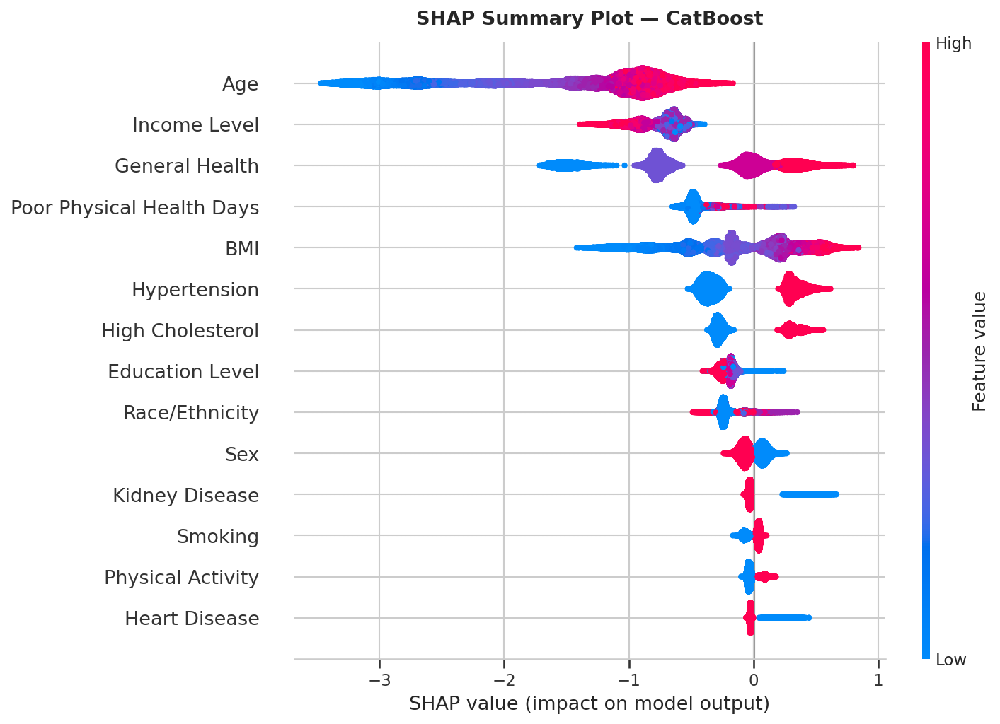

# Diabetes Risk Predictor — Early Detection of Type 2 Diabetes Using Machine Learning and Explainable AI

> Can a machine learning model identify who is at risk of Type 2 diabetes — and explain _why_?

This project develops an end-to-end diabetes risk prediction system trained on clinical health data. Using an XGBoost classifier with SHAP and LIME explainability, the system predicts individual risk with high accuracy and surfaces the specific features driving each prediction — making it useful not just as a model, but as a decision-support tool for healthcare contexts.

---


---

## Business Understanding and Data Understanding

Type 2 diabetes affects over 500 million people worldwide and is one of the fastest-growing chronic diseases globally (International Diabetes Federation, 2021). Early identification of at-risk individuals is critical — intervention at the pre-diabetic stage can delay or prevent full onset entirely, reducing both patient burden and healthcare costs.

Traditional screening relies on manual clinical assessment, which is time-consuming, inconsistent, and does not scale to population-level prevention. Machine learning models trained on routine health indicators offer a scalable alternative — but only if clinicians can understand and trust the predictions they produce.

This project addresses both challenges: predictive accuracy through supervised classification, and interpretability through Explainable AI (XAI) techniques.

<!-- Add EDA visualizations here, e.g. class distribution, feature correlation heatmap -->
<!--  -->
<!--  -->

**Dataset:** The [Diabetes Prediction Dataset](https://www.kaggle.com/) sourced from Kaggle contains clinical features including glucose levels, BMI, age, blood pressure, and insulin, with a binary outcome indicating diabetes diagnosis.

---

## Modeling and Evaluation

<!-- Fill in after model training is complete -->

We trained and compared six classification algorithms:

| Model                          | Accuracy | F1-Score | ROC-AUC |
| ------------------------------ | -------- | -------- | ------- |
| Logistic Regression (baseline) | —        | —        | —       |
| Decision Tree                  | —        | —        | —       |
| Random Forest                  | —        | —        | —       |
| XGBoost                        | —        | —        | —       |
| LightGBM                       | —        | —        | —       |
| CatBoost                       | —        | —        | —       |

<!-- Replace — with actual metrics after evaluation -->

The final selected model achieved an accuracy of **—%** and a ROC-AUC of **—** on the held-out test set, outperforming the logistic regression baseline by **—** points on F1-Score.

<!-- Add confusion matrix and ROC curve images here -->
<!--  -->
<!--  -->

SHAP global feature importance identified **glucose**, **BMI**, and **age** as the top three predictors of diabetes risk. LIME was used to generate patient-level explanations for individual predictions.

<!-- Add SHAP summary plot here -->
<!--  -->

---

## Conclusion

<!-- Fill in after results are finalized -->

The model demonstrates that Type 2 diabetes risk can be predicted with high accuracy from routine clinical indicators, and that XAI techniques make those predictions interpretable to non-technical stakeholders. We recommend this system be used as a screening support tool — not a diagnostic replacement — to flag high-risk patients for follow-up clinical evaluation.

**Future work** includes real-time deployment with patient authentication, retraining pipelines for model drift, and integration with electronic health record systems.

---

## Repository Navigation

```
diabetes-risk-prediction-xai/
├── notebooks/              # Jupyter notebooks for each project phase
├── models/                 # Saved model and preprocessing artifacts
├── datasets/               # Raw and processed data
├── images/                 # All figures organized by phase
├── reports/                # Final report and proposal PDF
├── presentations/          # Presentation slides and speaker notes
├── app/                    # FastAPI backend + Next.js frontend
├── docs/                   # Architecture and methodology documentation
└── scripts/                # Utility scripts for training and dev
```

| Resource       | Link                                                                       |
| -------------- | -------------------------------------------------------------------------- |
| Final Notebook | [notebooks/diabetes_prediction.ipynb](notebooks/diabetes_prediction.ipynb) |
| Presentation   | [presentations/presentation.pdf](presentations/presentation.pdf)           |
| Final Report   | [reports/final_report.pdf](reports/final_report.pdf)                       |
| API Docs       | [docs/architecture.md](docs/architecture.md)                               |

---

## Reproducing This Project

### Prerequisites

- Python 3.10+
- Conda (recommended) or pip
- Node.js 18+ (for the frontend)

### Setup

**1. Clone the repository**

```bash
git clone https://github.com/S-Mwaura/diabetes-risk-prediction-xai.git
cd diabetes-risk-prediction-xai
```

**2. Create the environment**

```bash
conda env create -f environment.yml
conda activate diabetes-xai
```

Or with pip:

```bash
pip install -r requirements.txt
```

**3. Download the dataset**

```bash
bash scripts/download_dataset.sh
```

**4. Train the model**

```bash
bash scripts/train_and_save.sh
```

**5. Run the application**

```bash
bash scripts/run_dev.sh
```

The API will be available at `http://localhost:8000` and the frontend at `http://localhost:3000`.

---

## Contributors

| Name           | GitHub                                           |
| -------------- | ------------------------------------------------ |
| Stephen Mwaura | [@S-Mwaura](https://github.com/S-Mwaura)         |
| Angela Masaki  | [@MoonwaMasaki](https://github.com/MoonwaMasaki) |
| Diana Byegon   | [@byegond-beep](https://github.com/byegond-beep) |
| Kevin Kisengu  | [@K-OK27](https://github.com/K-OK27)             |
| Orandi Felix   | [@Orandifelix](https://github.com/Orandifelix)   |

---

## License

This project is licensed under the MIT License — see the [LICENSE](LICENSE) file for details.

---

## References

International Diabetes Federation. (2021). _IDF Diabetes Atlas_ (10th ed.). https://www.diabetesatlas.org

Lundberg, S. M., & Lee, S. I. (2017). A unified approach to interpreting model predictions. _Advances in Neural Information Processing Systems, 30_, 4765–4774.

Ribeiro, M. T., Singh, S., & Guestrin, C. (2016). "Why should I trust you?" Explaining the predictions of any classifier. _Proceedings of the 22nd ACM SIGKDD International Conference on Knowledge Discovery and Data Mining_, 1135–1144.

Rajkomar, A., Dean, J., & Kohane, I. (2019). Machine learning in medicine. _New England Journal of Medicine, 380_(14), 1347–1358.
